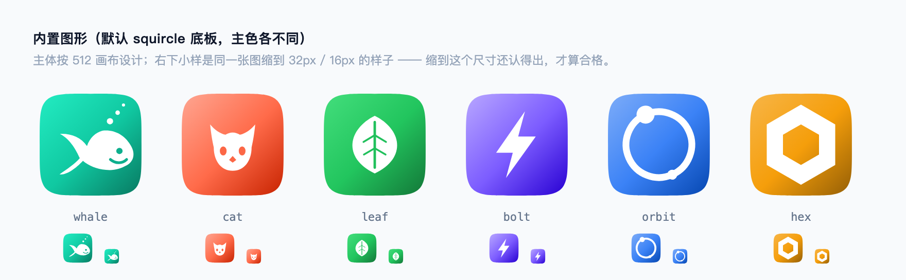
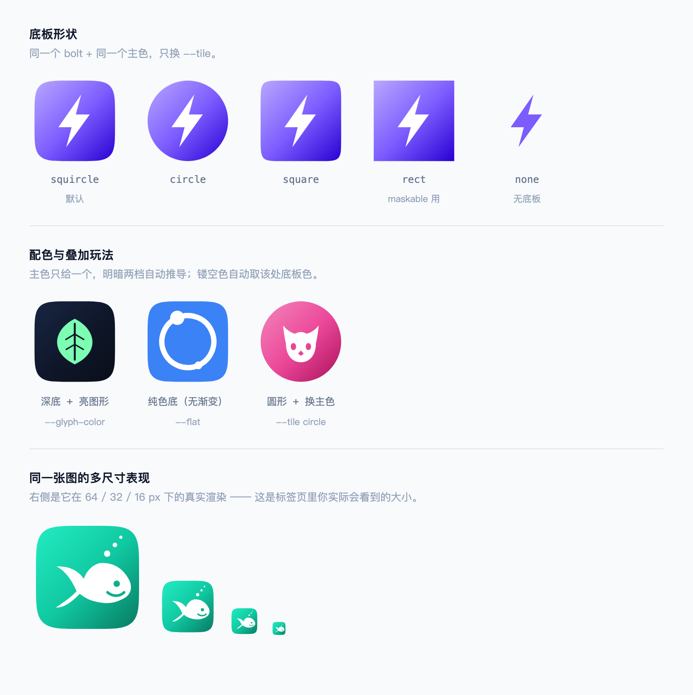

# iskill-app-icon

一条命令，从「一个图形 + 一个颜色」到**能直接用的整套图标**。

```bash
# macOS / Linux
bash scripts/make-all.sh --glyph whale --color '#10C8A1' --outdir public --name "我的应用" --sheet

# Windows（PowerShell）
powershell -NoProfile -ExecutionPolicy Bypass -File scripts\make-all.ps1 --glyph whale --color '#10C8A1' --outdir public --name "我的应用" --sheet
# 也可以直接双击 scripts\make-all.cmd
```

产出：`favicon.svg` · `favicon.ico`（内嵌 16/32/48，老浏览器兼容）· `favicon-32/48.png` ·
`apple-touch-icon.png` · `icon-192/512.png` · `maskable-512.png` · `site.webmanifest` ·
（`--sheet` 时）多尺寸预览图，最后打印要贴进 `<head>` 的片段。

## 样本

下面是本技能**现场生成**的效果（源件在 `assets/samples/`，总览图在 `assets/`）。

**六个内置图形**，默认 squircle 底板、各配一个主色。每张图右下角是它缩到 **32px / 16px** 的真实样子 ——
缩到这个尺寸还认得出，才算合格：



**底板形状与配色玩法**。同一个图形只换 `--tile`，或只换一个主色：



想复现其中任意一张：

```bash
python3 scripts/make_icon.py --glyph whale --color '#10C8A1' --out whale.svg          # ≈ 第 1 张
python3 scripts/make_icon.py --glyph bolt  --color '#7C5CFF' --tile circle --out c.svg # ≈ 圆形那张
python3 scripts/make_icon.py --glyph leaf  --color '#0F172A' --glyph-color '#7CFFB2' --out d.svg # 深底亮图形
```

样本可一键重出（改了图形/配色算法后跑一次，文档里的图就跟着更新）：

```bash
bash scripts/make-samples.sh              # 重出 SVG 源件 + 两张总览图
bash scripts/make-samples.sh --svg-only   # 只重出 SVG，不需要浏览器
```

## 整体流程

```
   一个图形 + 一个主色
          │
          ├─ make_icon.py    超椭圆底板 + 渐变 + 手绘图形 → 干净矢量 SVG
          │                  （同色自动推导镂空色，不用手调）
          │
          ├─ render_png.py   本机 Chromium 无头渲染 → 各尺寸 PNG
          │                  （不需要 Pillow / cairosvg / librsvg）
          │
          └─ make_all.py    串起来 + 出 manifest + 打印接入片段
                             （.sh / .ps1 / .cmd 只是找解释器转参数的薄壳）
```

## 何时用

- 用户要做网站 / Web App / PWA / 小程序的图标，或问「favicon 怎么弄」。
- 已有图标但想换主色（本技能一条命令换掉，渐变和镂空色会跟着重算）。
- 需要 `apple-touch-icon`、`maskable` 这类**有具体平台规范**的派生件。
- 需要一个「看起来很专业」的占位图标 —— 比随手截个图强得多。
## 进阶：整套 SVG 资产（avatar / 徽章 / 收集品 / 图标族）

上面解决「一枚图标」；要一次产出一**套**风格统一的 SVG 资产（收集品 avatar、成就徽章、
图鉴陈列、图标族），走 `reference/svg-asset-sets.md` 的套件规范：

- 动工前定四件事：尺寸档（24 icon / 96 avatar）、色板、`<类型>-<编号>-<slug>` 命名、每枚一句话人设
- LLM 批量生成工作流：风格锚点前置 → 分批落盘（每 3~4 枚回读）→ 逐枚校验 → 变体比选
- 双主题 / 剪影态 / 稀有度分型的做法与验收清单

源文件备好后，用零依赖脚本提取成页面内嵌的 symbol 精灵表（校验 + sprite + JSON 清单一步到位）：

```bash
# 校验 16 枚资产：viewBox / 标签配平 / 无外部引用 / id 无重复
node $S/scripts/svg-symbol-extract.mjs docs/assets/avatars --check

# 校验 + 产出 sprite 片段（粘进 <body> 后 <use href="#id"> 引用）
node $S/scripts/svg-symbol-extract.mjs docs/assets/avatars --prefix av-

# 再出一份 JSON 资产清单（编号/文件/viewBox，喂给配置表或「App 覆盖默认资产」机制）
node $S/scripts/svg-symbol-extract.mjs docs/assets/avatars --out sprite.html --manifest manifest.json
```

实战出处：AI-Matrix 成长计划 16 枚数字资产（avatar ×9 + 徽章 ×7），方法论与踩坑见
**`reference/svg-asset-sets.md`**。


## 快速上手

```bash
S=~/.workbuddy/skills/iskill-app-icon

# 看有哪些图形可选
python3 $S/scripts/make_icon.py --list

# ① 只要一个 SVG（最常用）
python3 $S/scripts/make_icon.py --glyph leaf --color '#10C8A1' --out favicon.svg
python3 $S/scripts/make_icon.py --glyph cat  --color '#FF6B4A' --tile circle --out cat.svg
python3 $S/scripts/make_icon.py --glyph bolt --color '#7C5CFF' --flat --out bolt.svg

# ② SVG + 全套 PNG + manifest（推荐）
bash $S/scripts/make-all.sh --glyph orbit --color '#3B82F6' --outdir public \
     --name "网关控制台" --short "网关" --sheet
# Windows 同一条命令：
#   powershell -NoProfile -ExecutionPolicy Bypass -File $S\scripts\make-all.ps1 `
#     --glyph orbit --color '#3B82F6' --outdir public --name "网关控制台" --sheet

# ③ 只从已有 SVG 派生 PNG
python3 $S/scripts/render_png.py --svg favicon.svg --outdir public \
     --maskable-svg .maskable.svg --color '#10C8A1' --manifest

# ④ 校验：出多尺寸预览图，肉眼确认 16px 还认得出
python3 $S/scripts/render_png.py --svg favicon.svg --sheet --sheet-out icon-sheet.png
```

## 内置图形

| 图形 | 说明 | 适合 |
|---|---|---|
| `whale` | 白鲸（头朝右、尾鳍在左、头顶气泡） | 海洋 / 助手 / 通用 |
| `cat` | 猫头（尖耳 + 眼睛 + 鼻子） | 宠物 / 社区 / 亲子 |
| `leaf` | 叶片（主脉 + 侧脉） | 环保 / 健康 / 内容 |
| `bolt` | 闪电 | 性能 / 能源 / 加速 |
| `orbit` | 轨道环 + 卫星点 | 网关 / 链路 / 同步 |
| `hex` | 六边形环 | 抽象 / 科技 / 中台 |
| `s` | 字母 S（单线圆头） | 首字母为 S 的项目名 |

底板：`squircle`（默认，≈iOS 连续圆角）/ `circle` / `square` / `rect` / `none`（无底板，图形直接落在透明上）。

## 关键参数

| 参数 | 作用 |
|---|---|
| `--color` | 底板主色。**亮部与暗部会自动推导**，不用自己配三档 |
| `--glyph-color` | 图形颜色，默认白 |
| `--cutout` | 镂空细节色。默认自动取「该处底板的等效色」，所以眼睛/嘴读起来像**挖空** |
| `--tile` / `--inset` | 底板形状与四周留白（默认 30/512，约 6%）。**favicon 想「显大」用 0~12**，见 design-rules「留白决定看起来多大」 |
| `--scale` | 图形缩放（绕中心），做 maskable 用 0.76 |
| `--flat` | 底板改纯色，不要渐变 |
| `--no-clip` | 图形不被底板裁切 |
| `--theme` | JSON 覆盖 `{color, light, mid, dark, glyph_color}`，想完全自己控色时用 |

## 设计规则（照做就不会难看）

1. **不要描摹位图。** 把 PNG 转矢量会得到几千个点、几十 KB，还要为亚像素缝隙反复调参。
   手写 5~10 条贝塞尔，3~4 KB 更干净。本技能从"描摹 29 KB"改成"手绘 3.9 KB"就是这个原因。
2. **底板是超椭圆，不是圆角矩形。** 指数 `n=5` 最接近 iOS 连续圆角（等价圆角半径约 22% 边长）。
3. **渐变只给"同一色相的明暗"，不要跨色相。** 现在是左上提亮、右下压暗，中段回到主色（`offset=0.52`）。
4. **镂空细节必须用"该处底板的颜色"。** 用白色或黑色都会像贴纸。`color_on_gradient()` 会自动算。
5. **细节按 512 画布设计，按 32px 验收。** 缩到 32px 时缩放比是 1/16 —— 512 里的 16 单位只有 1px。
   想让一条线在 32px 还看得见，它在 512 里得 ≥ 20 单位粗。
6. **先比选再定稿。** 一次渲染多个变体并排看（见 `reference/design-rules.md` 的"变体对比法"），
   比反复改一个再刷新快得多。

细节与量化阈值见 **`reference/design-rules.md`**；接到 HTML / Vite / PWA 的代码见 **`reference/integration.md`**。

## 自己画一个新图形

图形就是一段 SVG 片段，加进 `scripts/make_icon.py` 的 `GLYPHS` 字典即可：

```python
"mycat": {
    "desc": "我的猫",
    "cutout_at": (256, 300),      # 取哪个点的底板色当镂空色
    "svg": """
  <path fill="{G}" d="M..."/>              <!-- {G} = 图形色 -->
  <circle cx="214" cy="284" r="15" fill="{C}"/>  <!-- {C} = 镂空色 -->
""",
},
```

规矩：
- 画在 **512×512** 画布上，主体落在安全区 `x/y ∈ [96, 416]`。
- 用三次贝塞尔（`C`）画曲线；**长直边要加密取点**，否则样条会在两端鼓出去。
- 转折处如果看着发尖/自交，多半是点距不均 —— 需要用向心参数化（`catmull_to_path()` 已内置）。
- 加法：`GLYPHS` 里加完，`--glyph mycat` 立刻可用；再跑 `bash scripts/make-samples.sh`
  就能把新图形加进上面的样本图，顺便验证它在 32px 下还认得出。

## 平台规范（本技能已按此实现）

| 产物 | 尺寸 | 底色 | 用途 |
|---|---|---|---|
| `favicon.ico` | 内嵌 16/32/48 三档 | **透明** | 老浏览器兜底（不认 `<link>` 时按约定路径 `/favicon.ico` 自动请求） |
| `favicon-32/48.png` | 32/48 | **透明** | 现代浏览器 `<link>` 显式指定 |
| `favicon.svg` | 矢量 | 透明（含自带圆角底板） | 现代浏览器首选，缩放不糊 |
| `apple-touch-icon.png` | 180 | **不透明**（iOS 自己加遮罩，透明会被填黑） | iOS 添加到主屏 |
| `icon-192/512.png` | 192/512 | **透明** | PWA manifest `purpose: "any"` |
| `maskable-512.png` | 512 | **满幅不透明**，内容缩到 76% | PWA manifest `purpose: "maskable"` |

> maskable 为什么要单独生成：若只是把小圆角图标缩到 80% 叠在纯色上，**圆角与底色之间会露出一圈接缝**。
> 正确做法是底板改成满幅 `rect`、内容缩到 0.76 再渲染 —— `make-all.sh` 已自动做这一步。

## 环境要求

- **Python 3.9+**，**零第三方依赖**（纯标准库：`math` / `argparse` / `json` / `subprocess` / `urllib`）。
  默认用 PATH 里的 `python3`；可用 `ISKILL_PYTHON=/path/to/python3` 覆盖。
- **Chromium 系浏览器**（只在渲染 PNG 时需要）。**三平台自动探测**：
  - macOS：`/Applications` 下的 Chrome / Chromium / Edge / Brave、`~/.agent-browser/browsers/chrome-*`、Playwright 缓存
  - Windows：`Program Files` / `Program Files (x86)` / `%LOCALAPPDATA%` 下的 `chrome.exe`、**`msedge.exe`（Edge 随系统预装，通常不用额外装）**、Playwright 缓存
  - Linux：PATH 里的 `google-chrome` / `chromium` / `chromium-browser` 等
  都找不到就用 `CHROME=/path/to/chrome` 指定。**不需要装 Pillow / cairosvg。**
- 只生成 SVG 的话，浏览器也不需要（`make_icon.py` 纯标准库）。
- **平台支持**：macOS / Windows / Linux 均可用 —— 真源是 `scripts/make_all.py`，
  `make-all.sh`（macOS/Linux）、`make-all.ps1` / `make-all.cmd`（Windows）只是薄壳。
  `make-samples.sh` 是**维护者脚本**（重出文档样本图），macOS/Linux 直接跑，Windows 用 Git Bash。

## 踩过的坑（省下你同样的两小时）

| 现象 | 原因与对策 |
|---|---|
| `--panel-password` 之类参数报 `expected one argument` | 值以 `-` 开头被当成 flag。生成随机串时限定字母数字 |
| 渲染出洋红/白色细刺、图案边缘缺口 | 均匀 Catmull-Rom 在点距不均处自交。用**向心**参数化（α=0.5，`catmull_to_path()` 已内置） |
| 直边被"拱弯"、上下边缘各偏 1px | 长直边被简化成两点后，样条在两端切线影响下向外鼓。**长边要加密取点** |
| 描摹位图得到的形状永远差一点点 | 别描摹。手绘 + 变体比选，两轮就能定 |
| maskable 露出一圈接缝 | 见上表：用 `--tile rect --inset 0 --scale 0.76` 单独出一份源件 |
| `pip install` 被沙箱拦、本地端口请求 502 | 本技能**不需要 pip**；渲染用无头浏览器，本地端口记得绕代理（`--noproxy '*'`） |
| **Windows 上渲染是空白 / 图不显示** | 页面里写的是 `src="C:\a\b.svg"` —— 浏览器把它当 scheme「c:」，根本加载不到（macOS 恰好能糊过去，所以这坑只在 Windows 暴露）。**必须转成合法 `file://` URI**：`"file://" + pathname2url(abspath)`，已在 `render_png.py` 的 `file_uri()` 里做好 |
| 无头渲染：**没有截图文件**，或进程**跑完不退出**（挂住） | 没有万能配方，看 Chrome 版本 + 是否受沙箱限制。本机实测（Chrome 154 for Testing / macOS）：裸 `--headless --disable-gpu`、**不传 profile** → 稳出一张图（只有无害的 CVDisplayLink 警告）；传 `--user-data-dir=<临时目录>` → Chrome 截完**不退出**，挂死（同命令单跑 >7min 只能 kill）；优先 `--headless=new` → GPU 进程直接 FATAL（`gpu_data_manager_impl_private.cc:417 GPU process isn't usable`，exit 6）。反过来在**受限沙箱**里 Chrome 又会因建不了默认 profile 而 SIGTRAP，那种环境才需要显式 `--user-data-dir`。`shoot()` 的策略 = 先裸 `--headless`，失败再退 `--headless=new`，**默认不带 profile** |
| 受限沙箱里报 `sandbox initialization failed: Operation not permitted` + GPU FATAL（exit 6） | 沙箱禁了 Chrome 自身 sandbox。对策：`shoot()` 已内置**第三重兜底**——加 `--no-sandbox` 重试（裸跑即出图并正常退出）。**千万别加 `--user-data-dir`** 想绕（实测挂死不退出）。另注意 `CHROME` env 要指向真实二进制——macOS 上 `/Applications/Google Chrome.app` 可能是沙箱里解析失败的链接（`ls` 看得见、`os.path.isfile` 为 False），用 `mdfind "kMDItemCFBundleIdentifier == 'com.google.Chrome'"` 找真实路径 |
